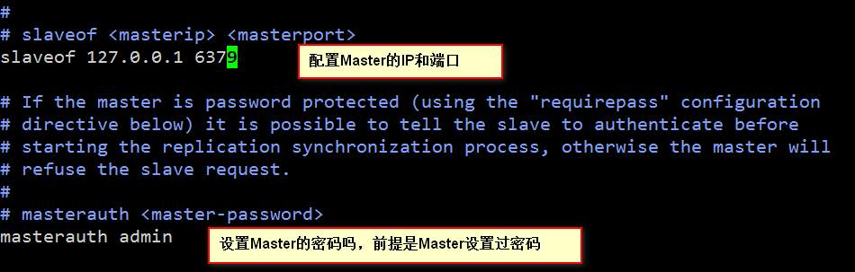

## Redis

### 一. 简介

​	Redis是一个开源的使用ANSI C语言编写、支持网络、可基于内存亦可持久化的日志型、Key-Value数据库，并提供多种语言的API。从2010年3月15日起，*Redis*的开发工作由VMware主持。从2013年5月开始，*Redis*的开发由Pivotal赞助。

​     下载地址：<https://github.com/microsoftarchive/redis/releases>

### 二. Redis的优势

**快**：Redis非常快，每秒可执行大约110000次的设置(SET)操作，每秒大约可执行81000次的读取/获取(GET)操作。

**支持丰富的数据类型**：Redis支持开发人员常用的大多数数据类型，例如列表，集合，排序集和散列等等。这使得Redis很容易被用来解决各种问题，因为我们知道哪些问题可以更好使用地哪些数据类型来处理解决。

**操作的原子性**：所有Redis操作都是原子操作，这确保如果两个客户端并发访问，Redis服务器能接收更新的值。

**很多使用工具**：Redis是一个多实用工具，可用于多种用例，如：缓存，消息队列(Redis本地支持发布/订阅)，应用程序中的任何短期数据，例如，web应用程序中的会话，网页命中计数等。

### 三. 数据类型

A. 字符串类型 (字符串的值，最大长度为512M)

B. 散列类型(Hash)  （map）

C. 列表类型(List) (列表的最大长度为2^32 -1个元素，大概40亿)

D. 集合类型(Set)  

E. 有序集合类型(zset)

### 四. 常用数据类型的操作

keys * : 获取数据库的所有的键。

exists key: 判断某个键是否存在，返回表示存在，0表示部存在。

type key: 获取键的类型(string，hash，list，set，zset)

#### 4.1 字符串的常用操作

```
set key value: 设置或者覆盖值。            ****
incr key : 将对应的键的值，递增1.
decr key : 将对应的键的值，递减1.
get key:  根据键取值。                      ****
del key [key1, key2,,]: 删除某个键。         ****
expire key 时间(秒)：设置key的存活时间，单位为秒。  ****
ttl code: 查看存活时间。 (TTL  Time To Live)  
setnx key value: 如果不存在就设置。(redis设置分布式锁)
```

#### 4.2 列表的操作

```
lpush key value: 往左侧中设置值。
rpush key value: 往右侧插入值。
lrange start end: 取集合中索引在[start, end]之间的值。
例：lrange aa 0 2   lrange aa 0 -1
llen key: 获取集合的长度。
lpop key: 移除并返回首元素。
rpop key: 移除并返回尾元素。
lrem key count value: 移除列表中count个值为value的数据。当count为0，移除所有。（了解）
ltrim key start end: 保留指定区域的元素，其他全部删除。  （了解）
lset key index value: 设置索引为index的值为value. 
lindex key index: 获取索引为index的元素。
```

#### 4.3 集合的操作

```
sadd key member [memerb..]: 往集合中添加元素，返回添加成功的个数。
smembers key: 返回集合中所有的元素。
srem key member: 删除元素。
sismember key member: 判断member是否存在, 存在返回1，不存在返回0。
scard key: 返回集合中的个数。
srandmember key: 从集合中随机返回一个值。(了解)
spop key: 移除并返回一个随机的member. （了解）
smove src destination member: 将一个元素移动到另外一个集合中。(了解)
sinter key key: 对集合求交集。 (了解)
sunion key key: 对两个集合求并集。(了解)
sdiffstore destination key1 key2:  差集运算并存储到集合中。（了解）
sinterstore destination key1 key2: 交集存储到集合中。(了解)
sunionstore destionation key1 key2: 并集存储到集合中。(了解)
```

#### 4.4 Hash操作

```
hset key field value: 设置值, 如果存在相同的Key，对应的值会覆盖之前的。
hmset key field value filed value: 设置多个值。
hget key field: 取值。
hexists key field: 是否存在。
hgetall key: 获取集合中所有的元素。
hdel key field: 删除字段。
hkeys key: 获取所有的key。
hvals key: 获取所有的字段值。
hlen key: 获取字段的数量。
hsetnx key field value : 不存在的时候设置值。
```

#### 4.5 有序集合

```
zadd key score value [score1 value1]: 添加。
zscore key value: 获取分数。
zrange key start end: 获取索引从start开始，到end结束的所有的元素。
zrange key start end withscores: 查询索引从start开始，到end结束的所有元素名和分数。
zcard key: 获取元素的个数。
zcount key min max: 获取在指定分数范围内的元素的个数。闭区间[min, max]
zrem key value1 [value2]: 删除元素。
zrank key value: 返回value在key中的下标。
zrangebyscore key begin end: 查询分数在[begin,end]区间的所有值，根据分数排序。
zrangebyscore key min max limit index length; 分页,min是最低分，max最高分，index是索引，length是长度。 
zrevrange key 2 3: 倒序排列，然后去取下标在[2, 3]区间的元素。(了解)
zremrangebyscore key min max:  移除分数在[min,max]之间的数据，返回移除的个数。(了解)
zremrangebyrank key begin end: 移除索引在[begin,end]之间的数据。(了解)
```

### 五. Redis配置

​	redis的核心配置文件为redis的解压目录下名为redis.windows.conf的模板文件，拷贝一份重命名为redis.conf文件。

#### 5.1 安全登录


#### 5.2 数据的持久化


#### 5.3 主从备份(灾备)(Master-Slave)



### 六. Redis 持久化之RDB和AOF

​	Redis 有两种持久化方案，RDB(Redis DataBase)和 AOF (Append Only File). 

#### 6.1 RDB存储

​	RDB 是 Redis 默认的持久化方案。在指定的时间间隔内，执行指定次数的写操作，则会将内存中的数据写入到磁盘中。即在指定目录下生成一个dump.rdb文件。Redis 重启会通过加载dump.rdb文件恢复数据。在5.2小结已经涉及到该存储的方式。

#### 6.2 AOF存储

​	Redis 默认不开启。它的出现是为了弥补RDB的不足（数据的不一致性），所以它采用日志的形式来记录每个**写操作**，并**追加**到文件中。Redis 重启的会根据日志文件的内容将写指令从前到后执行一次以完成数据的恢复工作。


#### 6.3 总结

1. Redis 默认开启RDB持久化方式，在指定的时间间隔内，执行指定次数的写操作，则将内存中的数据写入到磁盘中。
2. RDB 持久化适合大规模的数据恢复，但它的数据一致性和完整性较差。
3. Redis 需要手动开启AOF持久化方式，默认是每秒将写操作日志追加到AOF文件中。
4. AOF 的数据完整性比RDB高，但记录内容多了，会影响数据恢复的效率。
5. Redis 针对 AOF文件大的问题，提供重写的瘦身机制。
6. 若只打算用Redis 做缓存，可以关闭持久化。
7. 若打算使用Redis 的持久化。建议RDB和AOF都开启。其实RDB更适合做数据的备份，留一后手。RDB出问题了，还有AOF。

### 七. Linux中Redis的安装

​	Linux版Redis的下载地址为：<https://redis.io/download>

​	将Redis放入到Linux操作系统中，然后解压，进入到redis-5.0.5目录下：


执行 **make** 命令

```
make
```


如果在使用make命令的时候出现如上的错误，执行以下命令：

```
apt install gcc automake autoconf libtool make
```

再次执行 make 命令即可，**<font color="red">如果出现错误，可以使用 如下命令：</font>**

```
make MALLOC=libc
```

启动Redis, 进入到src目录下，执行如下命令：

```
./redis-server
```

### 八. Redis集群

A. 在redis的解压目录下新建rediscluster文件夹，将redis的解压目录下的redis.conf文件拷贝到rediscluster目录下，将该文件复制六份，名字分别为：

- redis-6379.conf
- redis-6380.conf
- redis-6381.conf
- redis-6382.conf
- redis-6383.conf
- redis-6384.conf

B. 以redis-6379.conf文件为例，修改其中的内容，修改部分内容如下：

```
port 6379
cluster-enabled yes
cluster-config-file /redis/nodes/nodes-6379.conf  #文件夹需要创建
cluster-node-timeout 15000
```

C. 分别启动六个redis服务，命令如下：

```
src/redis-server ../rediscluster/redis-6379.conf &
src/redis-server ../rediscluster/redis-6380.conf &
src/redis-server ../rediscluster/redis-6381.conf &
src/redis-server ../rediscluster/redis-6382.conf &
src/redis-server ../rediscluster/redis-6383.conf &
src/redis-server ../rediscluster/redis-6384.conf &
```


D. 配置集群，进入到redis的src目录下，执行如下命令：

```
./redis-cli --cluster create 127.0.0.1:6379 127.0.0.1:6380 127.0.0.1:6381 127.0.0.1:6382 127.0.0.1:6383 127.0.0.1:6384 --cluster-replicas 1
```


E. shell脚本启动，脚本内容如下：

```
#!/bin/bash
`/redis/redis-5.0.5/src/redis-server /redis/rediscluster/redis-6379.conf > /dev/null &` &&
`/redis/redis-5.0.5/src/redis-server /redis/rediscluster/redis-6380.conf > /dev/null &` &&
`/redis/redis-5.0.5/src/redis-server /redis/rediscluster/redis-6381.conf > /dev/null &` &&
`/redis/redis-5.0.5/src/redis-server /redis/rediscluster/redis-6382.conf > /dev/null &` &&
`/redis/redis-5.0.5/src/redis-server /redis/rediscluster/redis-6383.conf > /dev/null &` &&
`/redis/redis-5.0.5/src/redis-server /redis/rediscluster/redis-6384.conf > /dev/null &`

sleep 3s

`/redis/redis-5.0.5/src/redis-cli --cluster create 127.0.0.1:6379 127.0.0.1:6380 127.0.0.1:6381 127.0.0.1:6382 127.0.0.1:6383 127.0.0.1:6384 --cluster-replicas 1 > /dev/null &`
```

### 九. redis与spring boot整合

依赖配置：

```xml
<dependency>
	<groupId>org.springframework.boot</groupId>
 	<artifactId>spring-boot-starter-data-redis</artifactId>
</dependency> 
<!-- https://mvnrepository.com/artifact/org.apache.commons/commons-pool2 -->
<dependency>
    <groupId>org.apache.commons</groupId>
    <artifactId>commons-pool2</artifactId>
    <version>2.7.0</version>
</dependency>
```

代码中直接注入 RedisTemplate即可使用。

### 十. Mybatis二级缓存

#### 10.1 缓存类的实现

​	一级缓存，就是SqlSession级别的缓存；二级缓存就是SqlSessionFactory级别的缓存。

​	要想使用Mybatis的二级缓存，必须要实现Cache接口，具体的实现如下：

```java

public class RedisCache implements Cache {

    private RedisTemplate<Object, Object> redisTemplate;

    private ReadWriteLock readWriteLock = new ReentrantReadWriteLock();

    private String id;

    public RedisCache(){}

    public RedisCache(String id) {
        this.id = id;
    }

    private RedisTemplate<Object, Object> getRedisTemplate() {
        if(null == this.redisTemplate) {
            this.redisTemplate = (RedisTemplate)ApplicationContextHolder.getBean("redisTemplate");
        }
        return this.redisTemplate;
    }

    @Override
    public String getId() {
        return this.id;
    }

    @Override
    public void putObject(Object key, Object value) {
        if(value != null) {
            this.getRedisTemplate().opsForValue().set(key, value);
        }
    }

    @Override
    public Object getObject(Object key) {
        if(null != key) {
            return this.getRedisTemplate().opsForValue().get(key);
        }
        return null;
    }

    @Override
    public Object removeObject(Object key) {
        if(null != key) {
            this.getRedisTemplate().delete(key);
        }
        return null;
    }

    @Override
    public void clear() {
        Set<Object> set = getRedisTemplate().keys("*:" + this.id + "*");
        if(null != set) {
            getRedisTemplate().delete(set);
        }
    }

    @Override
    public int getSize() {
        return 0;
    }

    @Override
    public ReadWriteLock getReadWriteLock() {
        return this.readWriteLock;
    }
}
```

#### 10.2 获取ApplicationContext

```java
@Component
public class ApplicationContextHolder implements ApplicationContextAware {
    private static ApplicationContext applicationContext;

    @Override
    public void setApplicationContext(ApplicationContext applicationContext) throws BeansException {
        this.applicationContext = applicationContext;
    }

    public static ApplicationContext getApplicationContext() {
        return applicationContext;
    }

    public static Object getBean(String name) {
        return getApplicationContext().getBean(name);
    }
    public static <T> T getBean(Class<T> clazz) {
        return getApplicationContext().getBean(clazz);
    }
    public static <T> T getBean(String name, Class<T> clazz) {
        return getApplicationContext().getBean(name, clazz);
    }
}
```

#### 10.3 mapper.xml配置

```
<!--
        flushInterval: 清空缓存的时间间隔，单位为毫秒; 默认情况是不设置，也就是没有刷新间隔，缓存仅仅调用更新语句时刷新。
        size: 可以被设置为任意正整数, 缓存的数量，默认是1024;
        evication: LRU 移除最长时间不被使用的对象。
        blocking: 默认是false;
     -->
<cache size="1024" type="com.qf.cache.RedisCache" />  RedisCache c = new RedisCache();
```


