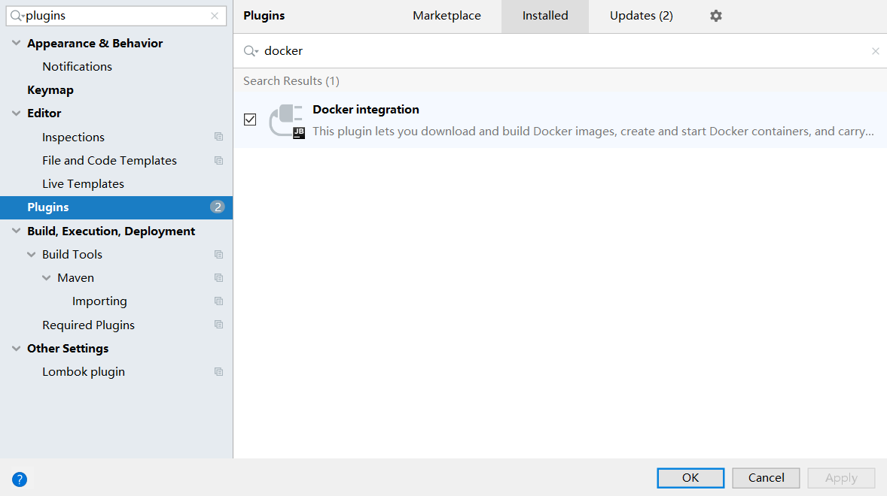
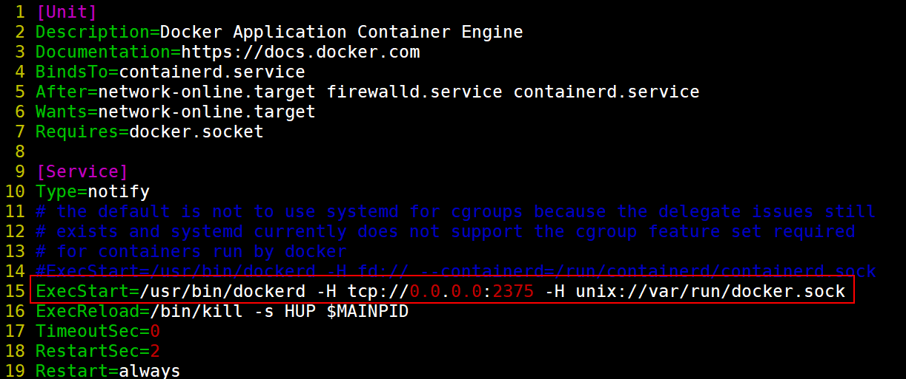
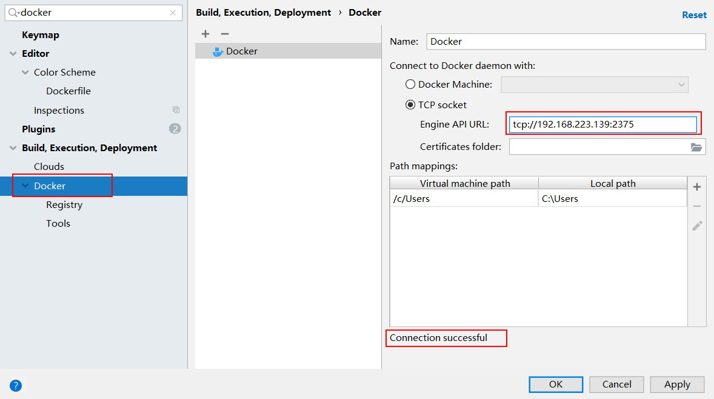
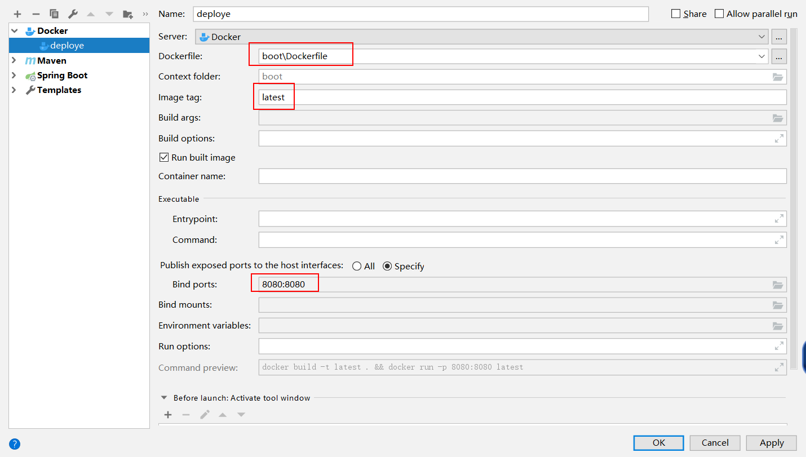
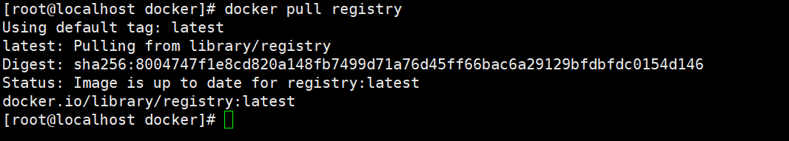
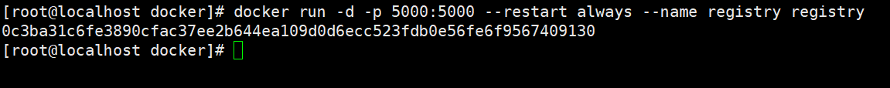
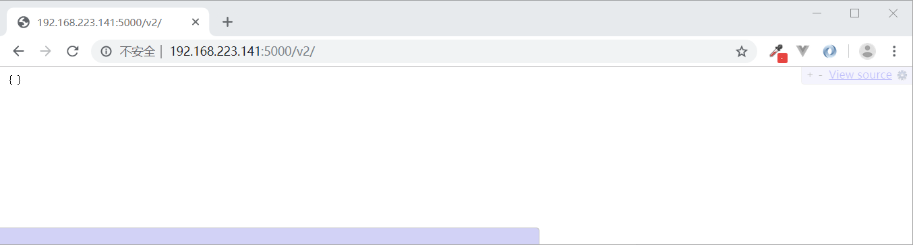
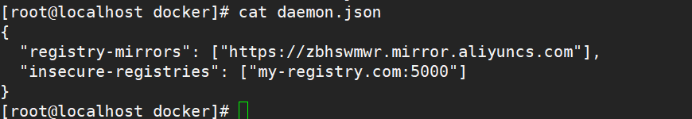
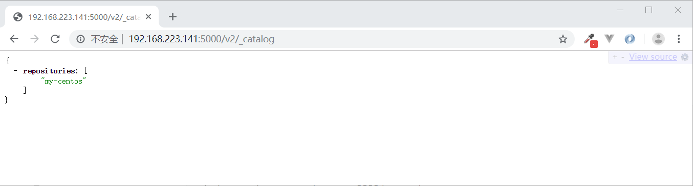

## Docker进阶

### 一. 数据卷(volume)

#### 1.1 为什么需要数据卷

​	docker镜像是由多个文件系统(只读层)叠加而成，当我们启动一个容器的时候，docker的服务端会加载镜像的只读层，并在最顶层创建一个可读写层。当运行的容器修改现有的文件，该文件会从只读层拷贝到读写层，其实并没有影响到镜像本身，依然存在于镜像中。当我们删除掉容器，容器运行时的数据都会丢失，当我们通过镜像重新run一个容器，该容器还是会回到最初的状态。那么问题来了，我们该如何保存我们运行中的数据了？这个问题有两种解决方法：a. 我们可以定期的将我们的容器通过commit的方式生成一个镜像；b.通过数据卷来实现。很明显我们不可能不停的commit来生成镜像，有些朋友可能会说你这么说的意思是通过数据卷来实现呗，可我都不知道什么是数据卷，怎么知道它好用了？那么接下来我们就开始来介绍数据卷。

#### 1.2 什么是数据卷

​	数据卷就是容器内部的数据目录直接映射到宿主机上的目录上，无论在宿主机还是容器内对数据的修改在另外一方都是可见的。

#### 1.3 数据卷的使用

##### 1.3.1 命令的使用

​	我们还是通过前面篇章中使用的centos镜像来讲解，其实也就一个命令，我们的工作也就是围绕着该命令来讲解：**docker run -it -v /dataVolumn:/containerDataVolumn centos**


​       至于其他的命令在这里不作过多的解释，只解释一下 **-v /dataVolumn:/containerDataVolumn** 这个命令的意思，-v是绑定将容器中的目录挂载到宿主机的目录上，/dataVolumn:/containerDataVolumn中冒号前的路径是指自动在宿主机上创建的目录名(不用我们手动去创建)，冒号后的路径是指在容器中自动创建的目录名。

##### 1.3.2数据卷的创建与测试

 	我们前面提到过“论在宿主机还是容器内对数据的修改在另外一方都是可见的”，那么本小节我们回来测试这个问题。

A.我们在容器中 /containerDataVolumn 目录下创建一个container.txt文件，并写入内容，命令：**echo "hello world" > container.txt**


​	在宿主机的 /dataVolumn目录下会查看到有container.txt文件，并查看内容，如下图所示：

	

B.在宿主机的 /dataVolumn目录下新建 host.txt文件，并写入内容，命令为：**echo "welcome" > host.txt**


​	在容器的/containerDataVolumn目录下会看到host.txt文件，并查看内容，如下图所示：


C.删除掉容器，查看宿主机 /dataVolumn目录，文件并没有丢失


D.我们可以通过 docker inspect 容器ID 命令查看容器的信息，其中hostConfig.binds可以查看到绑定信息，如下图所示：


##### 1.3.3 数据卷的其他创建方式

​	通过上面的方式创建数据卷的时候，我们每次在运行镜像的时候都需要去指定宿主机目录和容器目录，不便于维护与迁移，给大家举个例子：例如我们的日志文件是存放在容器中的 /cloud-project/logs目录下，而且在项目的配置文件中也是指定到该目录下，对应到我们的宿主机是/mycloud-project/logs目录，如果说由于项目发布启动的时候，运维人员写错了目录名，那将是很大的问题。所以我们在生成镜像文件的时候就指定数据卷的目录岂不是更好。

　　具体操作是，我们根据Dockerfile目录中通过VOLUMN指定数据卷的位置，至于什么是Dockerfile，在后面的篇章中会讲解。

A. 新建一个空的目录：**mkdir my-dockerfile**

B. 新建Dockerfile文件


C.在Dockerfile中添加如下内容：

```
FROM centos
VOLUMN ["/containerDataVolumn"]
CMD /bin/bash
```

D.执行命令 **docker build -t mycentos:me .**  生成名为mycentos，tag为me的新的镜像文件。**<font color="red">注意：最后的一个点不能省略，它不是结束的句号(我在这里栽了很大的跟头)！！！</font>**


E. 根据mycentos:me这个镜像启动一个容器，观察根目录下会生成 containerDataVolumn文件夹，如下图所示： 


F. 那么如何查看，容器中的数据卷目录对应的宿主机的目录呢？上一小节我们讲过，可以通过 docker inspect 容器ID 命令查看，结果如下图所示：  


<font color="red">**补充：**</font>mysql的数据卷的启动方式，如下：

```
docker run --name myMysql -e MYSQL_ROOT_PASSWORD=7890 -v /mydatas/mysql/datas:/var/lib/mysql -p 3307:3306 -d mysql:5.7.27
```

### 二. 容器数据卷(了解)

​	我们在上一节讲到使用数据卷实现容器数据的持久化，那么如何实现容器间数据的共享了？我们需要使用容器数据卷。其实就是利用数据卷的原理，将多个容器中的目录映射到宿主机的同一个目录，其实他们就是同一份文件。在一个容器中对数据的改变在其他容器中都是可以感知到的，原因说白了，每个容器中看到的其实就是同一份文件，我们可以通过：stat 文件名 查看文件的inode信息，发现inode的编号都一样。

A. 通过  docker run -it -v /host-datas:/container-datas --name u1 ubuntu:18.04   命令启动一个容器。

B. 通过  docker run -it  --volumes-from u1 --name u2 ubuntu:18.04 命令启动另外一个容器

C. 在u1容器中的 /container-datas 目录下创建abc.txt文件，然后在u2容器中/container-datas目录下可以看到该文件。同理在u2容器中创建一个文件，在u1容器中也能看到该文件。

### 三. Dockerfile

#### 2.1 Dockerfile是什么

​	Dockerfile是docker中镜像文件的的描述文件，说的直白点就是镜像文件到底是由什么东西一步步构成的。例如我们在淘宝上买了一件商品，但是这个商品需要组装才能使用，于是卖家就给了你一张图纸，你就按照图纸一步一步的组装起来，然后就成了你所需要的样子。那么Dockerfile就是这张图纸，镜像文件就是你需要的商品。Dockerfile名字可以随便命名，但是不建议你这做，还是按照规范来使用，首字母要大写。下面给出我们前几个章节使用到的ubuntu为例，来看看它的Dockerfile是怎么样的，如下图所示： 


#### 2.2 Dockerfile、镜像、容器

​	Dockerfile：是镜像的构建文件，描述的镜像是一步步怎么来的。

　　镜像：是通过Dockerfile做出来的，包含操作系统基础文件和软件运行环境，它使用分层的存储方式。

　　容器：是运行起来的镜像，简单理解，Docker镜像相当于程序，容器相当于进程。

#### 2.3 Dockerfile的基本语法及执行流程

##### 2.3.1 Dockerfile的基本语法

​	a.每个保留字必须放在每一行的开头，可以大写也可以小写，但是建议大写；

　　b.指令按照顺序，从上往下依次执行；

　　c.#表示注释；

　　d.每条执行指令都会创建一个新的镜像，并且执行提交。

##### 2.3.2 Dockerfile的执行流程

​	 a.docker从基础镜像中执行一个容器；　

　　 b.执行一条指令对容器进行修改；

　　 c.执行docker commit命令，提交新的镜像；

　　 d.在基于刚刚提交的镜像运行一个新的容器；

　　 e.执行Dockerfile中的下一条指令，按照b、c、d依次循环下去，直到所有的指令执行完毕。

##### 2.3.3 演示讲解

```
FROM centos                          #指定要生成的镜像的基础镜像，开头第一句话必须也只能是FROM
MAINTAINER  qf@163.com               #指定作者是谁
RUN apt-get install -y vim           #执行 yum install -y vim 命令，安装vim
RUN apt-get install -y net-tools     #执行 yum install -y net-tools, 安装net-tools工具
WORKDIR /dev/                        #启动容器后，如果启动交互模式，直接进入到哪个目录
CMD ["/bin/bash"]                    #启动容器的时候，进入到/bin/bash这种命令行
```

​	如上代码所示，FROM、MAINTAINER、RUN、WORKDIR、CMD均为关键字，按照标准的规范需要大写；FROM centos表示基础镜像是centos，然后会启动centos这个容器，执行第二行代码又会生成新的镜像文件，然后提交，周而复始。

#### 2.4 Dockerfile关键字

|   关键字   |            作用            |
| :--------: | :------------------------: |
|    FROM    |        指定基础镜像        |
| MAINTAINER |         作者的信息         |
|    RUN     |        执行什么命令        |
|   EXPOSE   |     容器对外暴露的端口     |
|  WORKDIR   | 进入到容器后进入到哪个目录 |
|    ENV     |        配置环境变量        |
|    ADD     |  将文件拷贝到镜像中并解压  |
|    COPY    |     将文件拷贝到镜像中     |
|   VOLUME   |         配置数据卷         |
|    CMD     |   容器启动时候执行的命令   |
| ENTRYPOINT |   容器启动时候执行的命令   |

A.ADD指令，现在定义这样一个Dockerfile，代码如下所示：

```
FROM ubuntu:18.04
MAINTAINER  qf@163.com
RUN mkdir /datas
ADD jdk-8u60-linux-x64.tar.gz /datas/
WORKDIR /datas/
CMD ["/bin/bash"]
```

首先必须将jdk-8u60-linux-x64.tar.gz文件拷贝到Dockerfile同级目录下，如下图所示：


执行命令：**docker build -t myubuntu .**  构建myubuntu镜像，如下图所示：


然后启动容器，进入到 /datas/目录下，会发现 jdk1.8.0_60 目录，表示add命令还执行了解压命令，如下图所示：


B.COPY命令，先定义一个Dockerfile, 代码如下：

```
FROM centos
MAINTAINER  qf@163.com
RUN mkdir /datas
COPY jdk-8u60-linux-x64.tar.gz /datas/
WORKDIR /datas/
CMD ["/bin/bash"]
```

执行命令：**docker build -t myubuntu .**  构建myubuntu镜像。

然后启动容器，进入到 /datas/目录下，会看到jdk-8u60-linux-x64.tar.gz文件，并没有解压，如下图所示：


C.ENV命令，配置环境变量，还是用上面提到的jdk为例，做过Java开发的朋友都知道，jdk需要配置环境变量，Dockerfile的内容如下所示：

```
FROM ubuntu                      
MAINTAINER qf@163.com   
RUN mkdir -p /datas/ 
ADD jdk-8u60-linux-x64.tar.gz /datas/
ENV JAVA_HOME=/datas/jdk1.8.0_60                    #配置JAVA_HOME
ENV PATH=$JAVA_HOME/bin:$PATH                       #配置PATH
CMD ["/bin/bash"]
```

​	容器启动后，输入：java  -version命令，就能看到我们熟悉的内容了。

D.CMD关键字，在镜像构建阶段不执行，在容器启动阶段执行(而的RUN关键字定义的指令在容器构建阶段就会执行，请记住它与CMD的区别)。如果一个Dockerfile中有多个CMD命令，后面的会覆盖前面的，说白了只有最后一个生效，如下代码和注释：

```
............省略............
CMD echo "<<<<<<<<<<<nice to meet you>>>>>>>>>>"
CMD /bin/bash
CMD echo "==========How are you?============="    #当容器启动的时候只有该行代码会执行，会将前两行代码覆盖
```

​	CMD还有一个问题，就是当我们使用 docker run命令的时候，我们可以在整个docker命令的最后加上其他额外的命令，那么额外的命令会覆盖Dockerfile中所有的CMD命令，例如我们执行如下命令：docker run -it centos ls / -l，最终的结果如下图所示：  


E. ENTRYPOINT指令，和CMD命令差不多，如果一个Dockerfile中有多个ENTRYPOINT，只有最后一个生效。但是他们还是有区别的，如果ENTRYPOINT后面有CMD，当以exec的方式运行的时候，CMD的值会作为参数给ENTRYPOINT，可能很多人看到这句话不大理解，那么我们来两个例子：

例一：　　

```
FROM centos                      
MAINTAINER  zhengjingmao@163.com   
RUN mkdir -p /datas/ 
ENTRYPOINT ["echo", "hello"]
CMD ["world"]              #会将world作为echo hello的参数，最后的命令其实为echo hello world 
```


例二：

```
FROM centos                      
MAINTAINER  zhengjingmao@163.com   
RUN mkdir -p /datas/ 
ENTRYPOINT ["echo", "hello"]
```


总结：当我们理解了CMD和ENTRYPOINT两个命令的区别后，以后在使用的过程中就不会出现各种问题了。

### 四. docker-compose

​	在开发一个应用的时候，我们需要其他的很多东西，例如数据库，nginx，网站应用等很多的环境，而docker又推崇的是每一个容器只运行一个进程，那么我们势必得很多的容器，那么我们得通过docker build命令一个个的构建镜像，然后在通过docker run命令启动一个个容器，那么当我们修改了应用后，我们又得去重复上面的操作。而且容器与容器之间存在着很多的依赖，我们在操作的时候还得去考虑先启动哪个容器，在启动另外一个容器，这些操作和步骤都得花上大量的精力。那么docker-compose的出现就是为了解决这个问题。

​	docker-compose是一种容器编排技术，我们可以编写一个docker-compose.yml文件，在文件中编排好我们的服务，只用通过一个命令即可搞定所有的工作。

#### 3.1 安装docker-compose

A. 运行如下命令获取最新版的docker-compose

```
curl -L "https://github.com/docker/compose/releases/download/1.24.0/docker-compose-$(uname -s)-$(uname -m)" -o /usr/local/bin/docker-compose
```

B. 给二进制文件加上执行权限

```
chmod +x /usr/local/bin/docker-compose
```

如果docker-compose命令无效，可以给这个文件创建一个在 /usr/bin 目录下的一个软连接，如下所示：

```
ln -s /usr/local/bin/docker-compose /usr/bin/docker-compose
```

C. 验证docker-compose是否安装成功

```
docker-compose --version
```

#### 3.2 docker-compose.yml的编写

```
version: "3.7"

services:
  mysql: 
    image: mysql:5.7.26
    ports:
      - "3306:3306"
    environment: 
      - MYSQL_ROOT_PASSWORD=miller
    network_mode: "host"
    volumes:
      - "/datas/db:/var/lib/mysql"
      - "/docker-compose/mysql/my.cnf:/etc/my.cnf"
  eureka-server:
    build:
      context: ./eureka-server
      dockerfile: Dockerfile
    ports:
      - "8761:8761"
    network_mode: "host"
  provider:
    build:
      context: ./provider
      dockerfile: Dockerfile
    ports:
      - "6666:6666"
    network_mode: "host"
    depends_on:
      - "mysql"
    command: ["./wait-for-it.sh", "mysql:3306", "--", "java", "-jar", "provider.jar"]
  consumer:
    container_name: consumer
    build:
      context: ./consumer
    network_mode: "host"
    ports:
      - "8080:8080"
```

<font color="red">**version**</font>

指定docker-compose文件的版本，对应的版本信息如下：


**<font color="red">services</font>**

定义服务。

**<font color="red">image</font>**

指定基础镜像。

**<font color="red">ports</font>**

指定对外开放的端口。

**<font color="red">environment</font>**

配置环境变量。

**<font color="red">network_mode</font>**

网络模式，默认为bridge(桥接)模式。

**<font color="red">volumes</font>**

指定数据卷。

**<font color="red">context</font>**

要构建的镜像的上下文，说白了就是相对于docker-compose.yml文件的位置。

**<font color="red">dockerfile</font>**

指定Dockerfile文件的名字，如果名字为Dockerfile的话，不用指定。

**<font color="red">depends_on</font>**

指定容器所依赖的另外一个容器的服务名，但是并不会等待所依赖的容器启动才去启动这个容器。

#### 3.3 启动

docker-compose up: 如果没有构建过镜像，首先会构建镜像，然后启动容器。

docker-compose up --build: 无论镜像是否存在，首先会构建镜像，然后启动容器。

docker-compose start [service...]: 启动已经存在的容器。

#### 3.4 wait-for-it.sh使用

地址：<https://github.com/vishnubob/wait-for-it>

```
./wait-for-it.sh www.google.com:80 -- echo "google is up"
```

如果连接上谷歌的服务器，输出“google is up”

### 五. Docker的工程化实践

A. 创建spring-boot的工程。

​	在主类上加上@SpringBootApplication, 来标注该类为一个Spring-boot项目的启动类。

B.  编写代码。

C. 将spring-boot项目打包后的jar包上传到ubuntu的/spring-boot/目录下。

D. 执行：docker run -it -v /spring-boot:/jarDir -p 8088:8080 mcr.microsoft.com/java/jre:8u192-zulu-alpine  /bin/sh -c "java -jar /jarDir/spring-boot-1.0-SNAPSHOT.jar" 启动我们的docker的jre容器，然后运行我们java程序。

E. docker run -it -e MYSQL_ROOT_PASSWORD=123456 -p 3305:3306 mysql:5.7.26，启动mysql的容器。

F.  将mysql容器的数据通过数据卷的方式映射到宿主的目录下。

### 六. Idea与docker的整合

#### 6.1 安装docker插件



#### 6.2 配置docker的端口

​	修改/lib/systemd/system/docker.service文件，将14行代码改为：

```
ExecStart=/usr/bin/dockerd -H tcp://0.0.0.0:2375 -H unix://var/run/docker.sock
```



#### 6.3 插件设置



#### 6.4 Dockerfile

​	将Dockerfile文件放在项目的根目录下，文件内容如下：

```
FROM store/oracle/serverjre:8
MAINTAINER decent_cat@126.com
ADD /target/boot-1.0-SNAPSHOT.jar boot.jar
EXPOSE 8080
CMD ["java", "-jar", "boot.jar"]
```

#### 6.5 运行配置



### 七. Docker私有仓库的搭建

A. 拉去registry仓库

```
docker pull registry:2
```



B. 启动容器

```
docker run -d -p 5000:5000 --restart always --name registry registry:2
```



C. 在浏览器访问：<http://192.168.223.141:5000/v2/>，会出现如下内容，表示registry启动成功



D.更改 `/etc/hosts` 文件，在文件的末尾加入上下代码，其中`192.168.223.141` 是本机IP

```
192.168.223.141   my-registry.com
```

E. 在 `/etc/docker/daemon.json` 文件中加入如下内容：

```
"insecure-registries": ["my-registry.com:5000"]
```

代码的完整内容如下：



F. 重启docker服务，命令如下：

```
systemctl daemon-reload
systemctl restart docker
```

G. 推送自己的镜像到docker私有仓库中：

```
# 将我们要推送到私有仓库的centos镜像打一个标签，名字叫my-centos, 这是my-centos就与本地的centos关联#  上了 
docker tag centos my-registry.com:5000/my-centos

# 将之前已经关联的的镜像推送到私有镜像仓库
docker push my-registry.com:5000/my-centos
```



H. 查看镜像的命令

```
http://192.168.223.128:5000/v2/image_name/tags/list    #查看某个镜像的所有的tag
```

### 附录：

