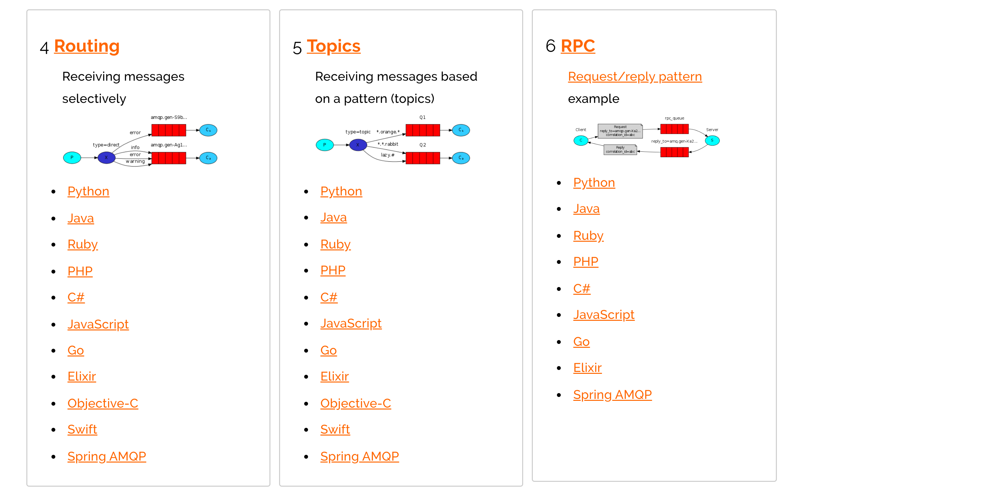

## RabbitMQ

### 一. 简介

> ​	RabbitMQ是用Erlang实现的一个高并发高可靠AMQP消息队列服务器。支持消息的持久化、事务、拥塞控制、负载均衡等特性，使得RabbitMQ拥有更加广泛的应用场景。RabbitMQ跟Erlang和AMQP有关。下面简单介绍一下Erlang和AMQP。
>
> ​	 Erlang是一门动态类型的函数式编程语言，它也是一门解释型语言，由Erlang虚拟机解释执行。从语言模型上说，Erlang是基于Actor模型的实现。在Actor模型里面，万物皆Actor，每个Actor都封装着内部状态，Actor相互之间只能通过消息传递这一种方式来进行通信。对应到Erlang里，每个Actor对应着一个Erlang进程，进程之间通过消息传递进行通信。相比共享内存，进程间通过消息传递来通信带来的直接好处就是消除了直接的锁开销(不考虑Erlang虚拟机底层实现中的锁应用)。
>
> ​	AMQP(Advanced Message Queue Protocol)定义了一种消息系统规范。这个规范描述了在一个分布式的系统中各个子系统如何通过消息交互。而RabbitMQ则是AMQP的一种基于erlang的实现。AMQP将分布式系统中各个子系统隔离开来，子系统之间不再有依赖。子系统仅依赖于消息。子系统不关心消息的发送者，也不关心消息的接受者。

### 二. rabbitmq基本原理

> ​	RabbitMQ是消息队列的一种实现，那么一个消息队列到底需要什么？答案是队列，即Queue，那么接下来所有名词都是围绕这个**Queue**来拓展的。
>
> ​	就RabbimtMQ而言，Queue是其中的一个逻辑上的实现，我们需要连接到RabbitMQ来操作队列进而实现业务功能，所以就会有**Connection**，我们发一条消息连接一次，这样很显然是浪费资源的，建立连接的过程也很耗时，所以我们就会做一个东西让他来管理连接，当我用的时候，直接从里边拿出来已经建立好的连接发信息，那么**ConnectionFactory**应运而生。
>
> ​	接下来，当程序开发时，可能不止用到一个队列，可能有订单的队列、消息的队列、任务的队列等等，那么就需要给不同的queue发信息，那么和每一个队列连接的这个概念，就叫**Channel**。
>
> ​	再往下来，当我们开发的时候还有时候会用到这样一种功能，就是当我发送一条消息，需要让几个queue都收到，那么怎么解决这个问题呢，难道我要给每一个queue发送一次消息？那岂不是浪费带宽又浪费资源，我们能想到什么办法呢，当然是我们发送给RabbitMQ服务器一次，然后让RabbitMQ服务器自己解析需要给哪个Queue发，那么**Exchange**就是干这件事的
>  但是我们给Exchange发消息，他怎么知道给哪个Queue发呢？这里就用到了**RoutingKey和BindingKey**
>  BindingKey是Exchange和Queue绑定的规则描述，这个描述用来解析当Exchange接收到消息时，Exchange接收到的消息会带有RoutingKey这个字段，Exchange就是根据这个RoutingKey和当前Exchange所有绑定的BindingKey做匹配，如果满足要求，就往BindingKey所绑定的Queue发送消息，这样我们就解决了我们向RabbitMQ发送一次消息，可以分发到不同的Queue的过程
>
> 至此，我们就把所有的名词贯通咯，接下来做个概要描述：
>
> - ConnectionFactory：与RabbitMQ服务器连接的管理器
> - Connection：与RabbitMQ服务器的TCP连接
> - Channel：与Exchange的连接，一个Connection可以包含多个Channel。之所以需要Channel，是因为TCP连接的建立和释放都是十分昂贵的，为了多路复用。RabbitMQ建议客户端线程之间不要共用Channel，但是建议尽量共用Connection。
> - Exchange：接受消息生产者的消息，并根据消息的RoutingKey和 Exchange绑定的BindingKey，以及Binding规则将消息路由给服务器中的队列。ExchangeType决定了Exchange路由消息的行为，例如，在RabbitMQ中，ExchangeType有direct、Fanout和Topic三种，不同类型的Exchange路由的行为是不一样的。
> - Message Queue：消息队列，用于存储还未被消费者消费的消息。
> - Message: 由Header和Body组成，Header是由生产者添加的各种属性的集合，包括Message是否被持久化、由哪个Message Queue接受、优先级是多少等。而Body是真正需要传输的APP数据。
> - RoutingKey：由Producer发送Message时指定，指定当前消息被谁接受
> - BindingKey：由Consumer在Binding Exchange与Message Queue时指定，指定当前Exchange下，什么样的RoutingKey会被下派到当前绑定的Queue中
> - Binding:联系了Exchange与Message Queue。Exchange在与多个Message Queue发生Binding后会生成一张路由表，路由表中存储着Message Queue所需消息的限制条件即Binding Key。当Exchange收到Message时会解析其Header得到Routing Key，Exchange根据Routing Key与**Exchange Type**将Message路由到Message Queue。Binding Key由Consumer在Binding Exchange与Message Queue时指定，而Routing Key由Producer发送Message时指定，两者的匹配方式由Exchange Type决定。
> - Server(broker): 接受客户端连接，实现AMQP消息队列和路由功能的进程。
> - Virtual Host:其实是一个虚拟概念，类似于权限控制组，可以通过命令分配给用户Virtual Host的权限，默认的guest用户是管理员权限，初始空间有/，一个Virtual Host里面可以有若干个Exchange和Queue，但是权限控制的最小粒度是Virtual Host
>    如下图：

### 三. 安装

#### 3.1安装erlang环境

> rabbitmq是使用erlang语言开发的，所以必须要先安装erlang环境。erlang的软件环境下载地址为：<https://www.erlang.org/downloads>，安装完毕之后需要配置环境变量：
>
>  `ERLANG_HOME=G:\erlang\erl-23.0`


#### 3.2 安装rabbitmq

> 本教程采用解压的方式进行安装。rabbitmq的下载地址为：<https://www.rabbitmq.com/install-windows.html>。


**A. 配置环境变量**

```
1.RABBITMQ_SERVER=G:\rabbitmq\rabbitmq_server-3.8.3
2.在path中加入：%RABBITMQ_SERVER%\sbin
```

**B.安装可视化工具和服务**

> 下载完毕之后进行解压，进入到家目录下的`sbin`目录下，执行如下命令，安装rabbitmq的web可视化工具：

```
rabbitmq-plugins.bat enable rabbitmq_management
```

> 安装rabbitmq的服务：`rabbitmq-server.bat install`

> 启动rabbitmq的服务：`rabbitmq-server.bat start`

> 在浏览器输入：<http://localhost:15672/>，访问rabbitmq的控制台，用户名和密码均为 `guest`


#### 3.3 使用docker安装

```dockerfile

```

### 四. RabbitMQ程序的编写

#### 4.1 rabbitMQ支持的消息模型




#### 4.2 引入依赖

```xml
<dependency>
      <groupId>com.rabbitmq</groupId>
      <artifactId>amqp-client</artifactId>
      <version>5.8.0</version>
</dependency>
```

#### 4.3 简单模型(直连)


在上图的模型中，有以下概念：

- P：生产者，也就是要发送消息的程序
- C：消费者：消息的接受者，会一直等待消息到来。
- queue：消息队列，图中红色部分。类似一个邮箱，可以缓存消息；生产者向其中投递消息，消费者从其中取出消息。

##### 4.3.1 生成者

```java
public class Producer {
    public static void main(String[] args) throws Exception {
        String host = "localhost";
        int port = 5672;
        String username = "guest";
        String password = "guest";
        ConnectionFactory factory = new ConnectionFactory();
        factory.setHost(host);
        factory.setPort(port);
        factory.setUsername(username);
        factory.setPassword(password);

        Connection conn = factory.newConnection();

        Channel channel = conn.createChannel();

        channel.queueDeclare("test", true, false, false, null);
        
        channel.basicPublish("", "test", null, (i + "hello").getBytes());

        RabbitMQUtils.close(conn, channel);
    }
}
```

##### 4.3.2 消费者

```java
public class Consumer1 {
    public static void main(String[] args) throws Exception{
        Connection conn = RabbitMQUtils.getConnection();

        Channel channel = conn.createChannel();

        channel.basicConsume("test", true, new DefaultConsumer(channel){
            @Override
            public void handleDelivery(String consumerTag, Envelope envelope, AMQP.BasicProperties properties, byte[] body) throws IOException {
                System.out.println("Consumer-one: 收到的消息: " + new String(body));
            }
        });
    }
}
```

#### 4.4  工作模型(work quene)

> `Work queues`，也被称为（`Task queues`），任务模型。当消息处理比较耗时的时候，可能生产消息的速度会远远大于消息的消费速度。长此以往，消息就会堆积越来越多，无法及时处理。此时就可以使用work 模型：**让多个消费者绑定到一个队列，共同消费队列中的消息**。队列中的消息一旦消费，就会消失，因此任务是不会被重复执行的。


##### 4.4.1 消息生产者

```java
for (int i = 0; i < 20; i++) {
	channel.basicPublish("", "test", null, (i + "hello").getBytes());
}
```

##### 4.4.2 多个消费者

**消费者一**

```java
public class Consumer1 {
    public static void main(String[] args) throws Exception{
        Connection conn = RabbitMQUtils.getConnection();

        Channel channel = conn.createChannel();

        channel.basicConsume("test", true, new DefaultConsumer(channel){
            @Override
            public void handleDelivery(String consumerTag, Envelope envelope, AMQP.BasicProperties properties, byte[] body) throws IOException {
                System.out.println("Consumer-one: 收到的消息: " + new String(body));
            }
        });
    }
}
```

**消费者二**

```java
public class Consumer1 {
    public static void main(String[] args) throws Exception{
        Connection conn = RabbitMQUtils.getConnection();

        Channel channel = conn.createChannel();

        channel.basicConsume("test", true, new DefaultConsumer(channel){
            @Override
            public void handleDelivery(String consumerTag, Envelope envelope, AMQP.BasicProperties properties, byte[] body) throws IOException {
                try {
                    TimeUnit.SECOND.sleep(3);
                }catch(Exception ex){}
                System.out.println("Consumer-one: 收到的消息: " + new String(body));
            }
        });
    }
}
```

##### 4.4.3 消息自动确认

> Doing a task can take a few seconds. You may wonder what happens if one of the consumers starts a long task and dies with it only partly done. With our current code, once RabbitMQ delivers a message to the consumer it immediately marks it for deletion. In this case, if you kill a worker we will lose the message it was just processing. We'll also lose all the messages that were dispatched to this particular worker but were not yet handled.
>
> But we don't want to lose any tasks. If a worker dies, we'd like the task to be delivered to another worker.

```java
channel.basicQos(1); // 每次只消费一条消息
channel.queueDeclare("firstQueue", false, false, false, null);

// 消息改为手动确认
channel.basicConsume("firstQueue", false, new DefaultConsumer(channel) {
@Override
public void handleDelivery(String consumerTag, Envelope envelope, 
                           AMQP.BasicProperties properties, byte[] body) throws IOException {
        try {
            TimeUnit.SECONDS.sleep(4);
        } catch (InterruptedException e) {
            e.printStackTrace();
        }
        System.out.println(new String(body, Charset.defaultCharset()));
        // 手动确认消息已经被消费了, 第一个参数是当前消费的消息的标签(递增的整数)
        // 第二个参数是否确认多条消息，包括之前消费的消息
        channel.basicAck(envelope.getDeliveryTag(), false);
	}
});
```

#### 4.5 发布订阅模型(fanout)


在广播模式下，消息发送流程是这样的：

- 可以有多个消费者
- 每个**消费者有自己的queue**（队列）
- 每个**队列都要绑定到Exchange**（交换机）
- **生产者发送的消息，只能发送到交换机**，交换机来决定要发给哪个队列，生产者无法决定。
- 交换机把消息发送给绑定过的所有队列
- 队列的消费者都能拿到消息。实现一条消息被多个消费者消费

##### 4.5.1 消息生成者

```java
Connection connection = RabbitMQUtils.getConnection();
Channel channel = connection.createChannel();

// 声明一个交换机, 交换机的类型为 fanout
channel.exchangeDeclare("multiple", BuiltinExchangeType.FANOUT);

channel.basicPublish("multiple", "", null, "fanout-message".getBytes());

RabbitMQUtils.close(channel, connection);
```

##### 4.5.2 消息消费者

> 使用如下代码创建多个消息的消费者

```java
Connection connection = RabbitMQUtils.getConnection();

Channel channel = connection.createChannel();

//String qName = channel.queueDeclare("consumer-2", false, false, false, null).getQueue();
String qName = channel.queueDeclare().getQueue(); //创建临时队列

channel.queueBind(qName, "multiple", "");

channel.basicConsume(qName, true, new DefaultConsumer(channel) {
	@Override
	public void handleDelivery(String consumerTag, Envelope envelope, 
                           AMQP.BasicProperties properties, byte[] body) throws IOException {
		System.out.println(new String(body, Charset.defaultCharset()));
	}
});
```

#### 4.6 直连模型(direct)

> 在Fanout模式中，一条消息，会被所有订阅的队列都消费。但是，在某些场景下，我们希望不同的消息被不同的队列消费。这时就要用到Direct类型的Exchange。

在Direct模型下：

- 队列与交换机的绑定，不能是任意绑定了，而是要指定一个`RoutingKey`（路由key）
- 消息的发送方在 向 Exchange发送消息时，也必须指定消息的 `RoutingKey`。
- Exchange不再把消息交给每一个绑定的队列，而是根据消息的`Routing Key`进行判断，只有队列的`Routingkey`与消息的 `Routing key`完全一致，才会接收到消息

.png)

##### 4.6.1 消息生产者

```java
// 声明一个交换机, 交换机的类型为 direct
channel.exchangeDeclare("direct-module", BuiltinExchangeType.DIRECT);

channel.basicPublish("direct-module", "success", null, "成功信息".getBytes());
channel.basicPublish("direct-module", "error", null, "错误信息".getBytes());
```

##### 4.6.2 消息消费者

**消费者一**

```java
String qName = channel.queueDeclare().getQueue(); //创建临时队列
channel.queueBind(qName, "direct-module", "success");

channel.basicConsume(qName, true, new DefaultConsumer(channel) {
@Override
public void handleDelivery(String consumerTag, Envelope envelope, 
                AMQP.BasicProperties properties, byte[] body) throws IOException {
		System.out.println(new String(body, Charset.defaultCharset()));
	}
});
```

**消费者二**

```java
String qName = channel.queueDeclare().getQueue(); //创建临时队列
channel.queueBind(qName, "direct-module", "success");

channel.basicConsume(qName, true, new DefaultConsumer(channel) {
@Override
public void handleDelivery(String consumerTag, Envelope envelope, 
                AMQP.BasicProperties properties, byte[] body) throws IOException {
		System.out.println(new String(body, Charset.defaultCharset()));
	}
});
```

4.7 主题模式(topic)

> `Topic`类型的`Exchange`与`Direct`相比，都是可以根据`RoutingKey`把消息路由到不同的队列。只不过`Topic`类型`Exchange`可以让队列在绑定`Routing key` 的时候使用通配符！这种模型`Routingkey` 一般都是由一个或多个单词组成，多个单词之间以”.”分割，例如： `item.insert`

.png)

```markdown
# 统配符
		* (star) can substitute for exactly one word.    匹配不多不少恰好1个词
		# (hash) can substitute for zero or more words.  匹配一个或多个词
# 如:
		audit.#    匹配audit.irs.corporate或者audit.irs 等
        audit.*   只能匹配 audit.irs
```

4.7.1 消息生产者

```java
// 声明一个交换机, 交换机的类型为 fanout
channel.exchangeDeclare("topic-module", BuiltinExchangeType.TOPIC);

channel.basicPublish("topic-module", "company.java", null, "通知信息".getBytes());
//channel.basicPublish("topic-module", "error", null, "错误信息".getBytes());

RabbitMQUtils.close(channel, connection);
```

4.7.2 消息消费者

**消费者一**

```java
String qName = channel.queueDeclare().getQueue(); //创建临时队列
channel.queueBind(qName, "topic-module", "company.#");

channel.basicConsume(qName, true, new DefaultConsumer(channel) {
@Override
public void handleDelivery(String consumerTag, Envelope envelope, 
                  AMQP.BasicProperties properties, byte[] body) throws IOException {
		System.out.println(new String(body, Charset.defaultCharset()));
	}
});
```

**消费者二**

```java
String qName = channel.queueDeclare().getQueue(); //创建临时队列
channel.queueBind(qName, "topic-module", "company.java.#");

channel.basicConsume(qName, true, new DefaultConsumer(channel) {
@Override
public void handleDelivery(String consumerTag, Envelope envelope, 
                  AMQP.BasicProperties properties, byte[] body) throws IOException {
		System.out.println(new String(body, Charset.defaultCharset()));
	}
});
```

**消费者三**

```java
String qName = channel.queueDeclare().getQueue(); //创建临时队列
channel.queueBind(qName, "topic-module", "company.html.*");

channel.basicConsume(qName, true, new DefaultConsumer(channel) {
@Override
public void handleDelivery(String consumerTag, Envelope envelope, 
                  AMQP.BasicProperties properties, byte[] body) throws IOException {
		System.out.println(new String(body, Charset.defaultCharset()));
	}
});
```

**结论**

```
company: 可以被消费者一接收到
company.java: 可以被消费者一、消费者二接收到
company.java.manager: 可以被消费者一、消费者二接收到
company.html.teacher: 可以被消费者一、消费者三接收到
```

### 五. RabbitMQ与springboot整合

#### 5.1 依赖

```xml
<dependencies>
	<dependency>
		<groupId>org.springframework.boot</groupId>
		<artifactId>spring-boot-starter-amqp</artifactId>
	</dependency>
	<dependency>
		<groupId>org.springframework.boot</groupId>
		<artifactId>spring-boot-starter-web</artifactId>
	</dependency>
	<dependency>
		<groupId>com.alibaba</groupId>
		<artifactId>fastjson</artifactId>
		<version>1.2.4</version>
	</dependency>
	<dependency>
		<groupId>org.springframework.boot</groupId>
		<artifactId>spring-boot-starter-test</artifactId>
		<scope>test</scope>
		<exclusions>
			<exclusion>
				<groupId>org.junit.vintage</groupId>
				<artifactId>junit-vintage-engine</artifactId>
			</exclusion>
		</exclusions>
	</dependency>
	<dependency>
		<groupId>org.projectlombok</groupId>
		<artifactId>lombok</artifactId>
	</dependency>
</dependencies>
```

#### 5.2 使用json的序列化

```java
// 消息的消费方json数据的反序列化
@Bean
public RabbitListenerContainerFactory<?> rabbitListenerContainerFactory(
    			ConnectionFactory connectionFactory){
    SimpleRabbitListenerContainerFactory factory = new SimpleRabbitListenerContainerFactory();
    factory.setConnectionFactory(connectionFactory);
    factory.setMessageConverter(new Jackson2JsonMessageConverter());
    return factory;
}

// 定义使用json的方式转换数据
@Bean
public RabbitTemplate rabbitTemplate(ConnectionFactory connectionFactory) {
    RabbitTemplate amqpTemplate = new RabbitTemplate();
    amqpTemplate.setConnectionFactory(connectionFactory);
    amqpTemplate.setMessageConverter(new Jackson2JsonMessageConverter());
    return amqpTemplate;
}
```

#### 5.3 简单模型

**消息消费方**

```java
@RabbitListener(queuesToDeclare = {@Queue("simpleQueue")})
public void simpleModel(User user) {
	log.info("message: {}", user);
}
```

**消息发送**

```java
@SpringBootTest
class SpringbootRabbitmqApplicationTests {
    @Resource
    private RabbitTemplate rabbitTemplate;

    @Test
    public void simpleMessageSend() {
        rabbitTemplate.convertAndSend("simpleQueue", new User(1, "张"));
    }
}
```

#### 5.4 工作模型

> 工作模式只需要在简单模式的基础上，添加一个消息的消费方。

#### 5.5 发布订阅模型

**消息消费方**

```java
// value=@Queue 创建临时队列
// exchange创建交换机
@RabbitListener(bindings = {
	@QueueBinding(value = @Queue,
		exchange = @Exchange(value = "fanout-ex", type = ExchangeTypes.FANOUT))
})
public void receiveMessage1(User user) {
	System.out.println(String.format("消费者 【one】: %s", user));
}

@RabbitListener(bindings = {
	@QueueBinding(value = @Queue,
		exchange = @Exchange(value = "fanout-ex", type = ExchangeTypes.FANOUT))
})
public void receiveMessage2(User user) {
	System.out.println(String.format("消费者 【two】: %s", user));
}
```

**消息发送方**

```java
// fanout模型
@Test
public void fanoutMessageSend() {
	for (int i = 0; i < 5; i++) {
		rabbitTemplate.convertAndSend("fanout-ex", "", new User(i, "张三"));
	}
	try {
		TimeUnit.SECONDS.sleep(5);
	} catch (InterruptedException e) {
		e.printStackTrace();
	}
}
```

#### 5.6 直连模式(direct)

**消息的消费方**

```java
@RabbitListener(bindings = {
            @QueueBinding(value = @Queue,
                    key = {"error", "success"},
                    exchange = @Exchange(value = "direct-ex", type = ExchangeTypes.DIRECT))
})
public void receiveMessage1(User user) {
        System.out.println(String.format("消费者 【one】: %s", user));
}

@RabbitListener(bindings = {
      @QueueBinding(value = @Queue,
            key = {"error"},
            exchange = @Exchange(value = "direct-ex", type = ExchangeTypes.DIRECT))
})
public void receiveMessage2(User user) {
    System.out.println(String.format("消费者 【two】: %s", user));
}
```

**消息生产者**

```java
@Test
public void directMessageSend() {
	//rabbitTemplate.convertAndSend("direct-ex", "success", new User(2, "张三"));
	rabbitTemplate.convertAndSend("direct-ex", "error", new User(2, "张三"));
	try {
		TimeUnit.SECONDS.sleep(10);
	} catch (InterruptedException e) {
		e.printStackTrace();
	}
}
```

#### 5.7 topic模型

**消息的消费方**

```java
@RabbitListener(bindings = {
	@QueueBinding(value = @Queue,
		key = {"company.#"},
		exchange = @Exchange(value = "topic-ex", type = ExchangeTypes.TOPIC))
})
public void receiveMessage1(User user) {
	System.out.println(String.format("消费者 【one】: %s", user));
}

@RabbitListener(bindings = {
	@QueueBinding(value = @Queue,
		key = {"company.java.#"},
		exchange = @Exchange(value = "topic-ex", type = ExchangeTypes.TOPIC))
})
public void receiveMessage2(User user) {
	System.out.println(String.format("消费者 【two】: %s", user));
}

@RabbitListener(bindings = {
	@QueueBinding(value = @Queue,
		key = {"company.html.*"},
		exchange = @Exchange(value = "topic-ex", type = ExchangeTypes.TOPIC))
})
public void receiveMessage3(User user) {
System.out.println(String.format("消费者 【three】: %s", user));
}
```

**消息生产方**

```java
@Test
public void topicMessageSend() {
	//rabbitTemplate.convertAndSend("topic-ex", "company", new User(2, "张三"));
	rabbitTemplate.convertAndSend("topic-ex", "company.java", new User(2, "张三"));
	try {
		TimeUnit.SECONDS.sleep(2);
	} catch (InterruptedException e) {
		e.printStackTrace();
	}
}
```

5.8 消息的手动确认

### 文档参考声明:

CSDN([sessinsong](https://me.csdn.net/sessionsong)):   <https://blog.csdn.net/sessionsong/article/details/86317991>

简书 ([jiangmo](https://www.jianshu.com/u/de31051e96e1))：<https://www.jianshu.com/p/64357bf35808>

