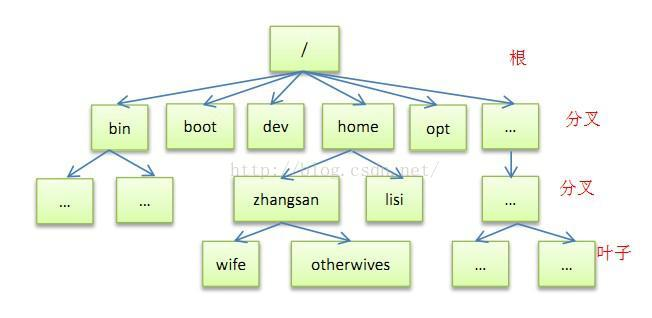
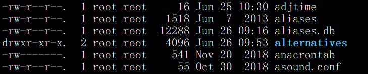
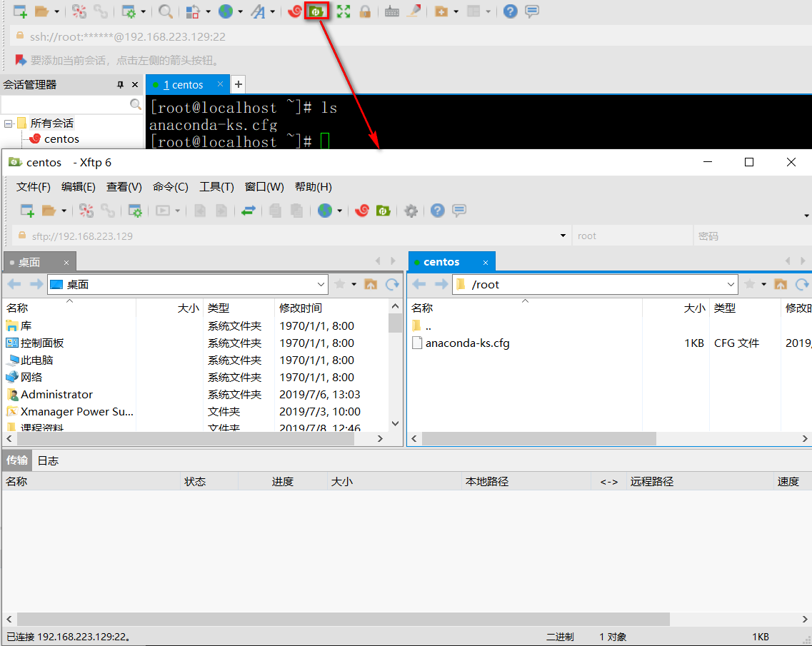
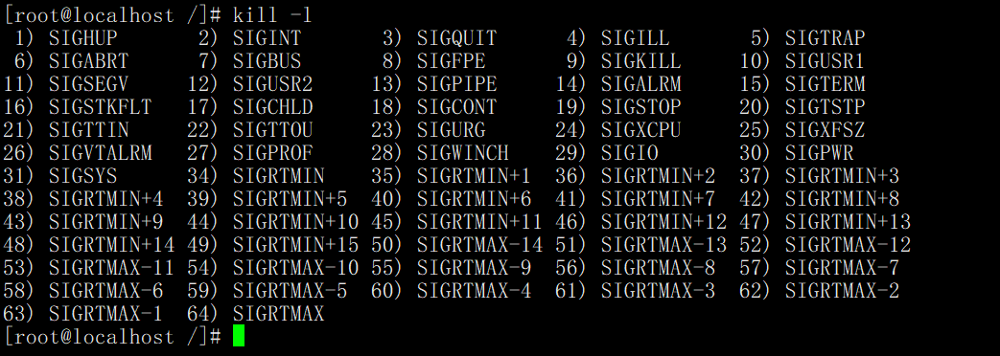

## Linux操作系统

-------------

### 一. linux操作系统的基本介绍

​	Linux是一套免费使用和自由传播的类unix操作系统。那么什么是类unix操作系统呢？在1969年由unix之父Ken Thompson在AT&T(American Telephone & Telegraph, 美国电话电报公司，现在为美国第二大运营商，第一大运营商为*Verizon* Wireless)的贝尔实验室主导研发的，当时完全是出于好奇或者兴趣。

​	在1974年7月首次unix首次与外界接触，当unix到达第五版的时候，以“仅用于教育目的”为协议，提供给各大学作为教学之用，成为当时操作系统课程中的范例教材。各大学公司开始通过Unix源码对Unix进行了各种各样的改进和扩展。于是，Unix开始广泛流行。在1979年，unix的V7版本发布，许可证开始禁止大学使用Unix的源码，包括在授课中学习。到了1980年，unix开始一发不可收拾地开发不停地出现各种各样的变种。

​	Linux操作系统包括但不限于unix所有的功能，是开源免费的，不需支付任何费用便能获取到它的源代码，可以根据自己的需求进行修改。Linux操作系统是由Linus Benedict Torvalds(林纳斯·本纳第克特·托瓦兹)在大学的时候编写的，并邀请大家进行完善，从此Linux操作系统成为服务器领域的首选操作系统。

​	我们所熟知的Centos、redhat、ubuntu等操作系统都是基于linux内核(kernel)基础上进行开发，形成了自己的产品。那么在本次课程中我们为大家使用的是ubuntu操作系统讲解Linux操作系统的基本使用。

----

### 二. Linux操作系统的安装

​	ubuntu操作系统安装以及链接工具的安装参照视频，视频地址为：	

---

### 三. Linux的目录结构

​	linux的目录结构与windows有很大的区别，windows有盘符的概念，例如C盘，D盘等。而Linux的目录结构类似于一棵倒着的树，最顶层的就是根目录：如下图所示



| 目录名 |                             作用                             |
| :----: | :----------------------------------------------------------: |
|  /bin  |                     存放最经常使用的命令                     |
| /boot  |          存放启动Linux操作系统的时候的一些核心文件           |
|  /etc  |                    存放系统管理和配置文件                    |
|  /dev  |                       用于存放设备文件                       |
| /home  |       存放的用户的目录，每个用户都有一个属于自己的目录       |
|  /opt  | 额外安装的可选应用程序包所放置的位置。一般情况下，我们可以把tomcat等都安装到这里。 |
|  /usr  | 用于存放系统应用程序，比较重要的目录/usr/local 本地系统管理员软件安装目录 |
|  /var  | 用于存放运行时需要改变数据的文件，也是某些大文件的溢出区，比方说各种服务的日志文件（系统启动日志等。）等。 |

---

### 四. Linux系统的基本操作

#### 1. 目录的切换（change directory）

- cd /test: 切换到 /test目录下进行操作。
- cd -: 切回到上一此编辑的目录。
- cd ~: 切回到当前用户的家目录。
- cd ..: 切到道歉目录的上一级目录。

#### 2. 文件内容的查看

- cat：查看文件的全部内容
- head: 默认查看文件内容的前10行
- tail：默认查看文件内容的后10行
- more：分页查看文件内容，使用空格键向下翻页，但是只能向下翻页。
- less：分页查看文件内容，使用空格键向下翻页，也可使用PgUp和PgDown实现向上、向下翻页。

#### 3. 查看文件夹中的内容

- ls(list)：查看文件夹中的内容

- ls -a: 查看文件夹中的内容，包括隐藏文件

- ls -l(可以简写成ll): 查看文件夹中的内容的详细信息

  

    查看到文件夹的详细信息后，会看到有七栏，那么我们分别来解释一下是什么意思：

  ​	第一栏：有10个符号，第一个符号表示表示文件的属性，-表示是文件，d是目录，l是连接文件；后面9为分别分三组，每组均为rwx，r是可读，w是可写，x是可执行，第一组表示当前的用户的权限，第二组是用户组的权限；第三组是其他用户的权限。

  ​	第二栏：是文件或者文件夹的个数，如果说文件就为1，如果目录的情况下就是该目录下文件夹的个数，其中包括当前目录和上级目录。

  ​	第三栏：当前文件或者文件夹所属的用户。

  ​	第四栏：当前文件或者文件夹所属的用户组。

  ​	第五栏：当前文件或者文件夹的大小，单位为KB。

  ​	第六栏：创建的时间。

  ​	第七栏：文件或者文件夹或者链接的名字。

#### 4. 相对路径、绝对路径

​         要高清相对路径首先要搞清楚.和..的这两个概念，一个点表示当前目录，即我们当前操作所处的目录；两个点表示上一级目录。

​	相对路径，所谓相对就必须要有一个参照物，例如两个同学A和他的同桌B，并且他们两个此时此刻正坐在一起。假如现在有人问A：“B在哪里？”，A回答道：“B就在我身边呀。”，那么此时A的回答就是以自己为参照物，B就在他身边。

​	绝对路径，就是以一个顶级的地址，而且这个地址我们都知道，例如“宇宙”、“地球”、“中国”、“北京”等都可以选择作为我们的顶级地址，我们同样以上面提到过的A和B这两个同桌为例，A还有另外一种回答：“他在地球上中国北京市昌平区区XX路XX楼X层XX房第X排第X个”，那么A这种回答的方式就是以地球作为顶级目录，然后逐层往下找。

​	那么我们在Linux操作系统中，相对路径所选择的参照物就是我们当前执行操作所处的目录；绝对路径所选择的顶级目录就是我们的根(/)目录。

#### 5. 文件夹、文件的创建

- **touch test:** 创建一个名为test的文件。
- mkdir test: 创建一个名为test的文件夹。
- mkdir -p /a/b: 创建目录a, 然后在目录a下创建目录b.

#### 6. 文件、文件夹的删除

- rm test: 删除名为test的文件或者空的文件夹，会出现询问是否要删除。
- rm -f test: 删除名为test的文件或者空的文件夹，不会出现提示。
- rm -rf test: 删除名为test的文件或者文件夹，-r是recursion，递归的意思。

#### 7. 文件或者文件夹的拷贝

- cp ./test  /data: 将当前目录下的test文件拷贝到 /data目录下。
- cp /test/a.txt /datas: 将/test目录下的a.txt文件靠别到/datas目录下。
- cp -r /test /datas: 将/test目录拷贝到/datas目录下，-r是recursion，递归的意思，无论/test文件夹是否为空。
- cp -r /test/* /datas/: 将/test目录下的所有内容拷贝到/datas目录下。

#### 8.文件、文件夹的移动

- mv test /datas: 将当前目录下的test文件或者文件夹移动到/datas目录下。
- mv /test/* /datas: 将/test目录下的所有内容移动到/datas目录下。

#### 9.文件、文件夹的重命令

-  mv test test1: 将test目录或者文件重命名为test1。

---

### 五. 文件、文件夹的上传、下载

​	我们可以直接使用xshell提供的工具实现文件的上传与下载。



---

### 六. vi、vim的使用

​	vi为linux操作系统自带的文本编辑器，其功能非常的强大，我们必须要掌握其使用，为我们修改各种配置或者编写脚本文件奠定基础。其快捷键命令如下：

| 命令                                         | 含义                                 | 命令的模式 |
| -------------------------------------------- | ------------------------------------ | ---------- |
| **<font color="red">Esc</font>** (重点)      | 从编辑模式进入到命令行模式           | 编辑模式   |
| **<font color="red">i</font>** (重点)        | 在当前字符前插入                     | 编辑模式   |
| **<font color="red">a</font>**               | 在当前字符后插入                     | 编辑模式   |
| A                                            | 在当前行末进行插入                   | 编辑模式   |
| I                                            | 在当前开头进行插入                   | 编辑模式   |
| **<font color="red">o</font>** (重点)        | 进入到当前行的下一行进行编辑         | 编辑模式   |
| **<font color="red">O</font>** (重点)        | 进入到当前行的上一行进行编辑         | 编辑模式   |
| **<font color="red">yy</font>** (重点)       | 复制一行                             | 编辑模式   |
| **<font color="red">p</font>** (重点)        | 粘贴yy复制的一行内容                 | 编辑模式   |
| **<font color="red">dd</font>** (重点)       | 删除一行                             | 编辑模式   |
| **<font color="red">h</font>** (重点)        | 向左移动光标                         | 编辑模式   |
| **<font color="red">l </font>** (重点)       | 向右移动光标                         | 编辑模式   |
| **<font color="red">j</font>** (重点)        | 光标向上移动                         | 编辑模式   |
| **<font color="red">k</font>** (重点)        | 光标向下移动                         | 编辑模式   |
| **<font color="red">G</font>**               | 光标移动文件的末尾                   | 命令行模式 |
| **<font color="red">gg</font>**              | 光标移动到文件的开头                 | 命令行模式 |
| **<font color="red">q</font>**               | 退出文件                             | 命令行模式 |
| **<font color="red">:wq</font>** (重点)      | 保存并退出                           | 命令行模式 |
| **<font color="red">:set nu!</font>** (重点) | 设置或取消行号                       | 命令行模式 |
| **<font color="red">u</font>** (重点)        | 撤销上一次操作                       | 命令行模式 |
| w                                            | 光标跳到下一个单词的首字母           | 命令行模式 |
| b                                            | 光标跳到上一个单词的首字母           | 命令行模式 |
| $                                            | 光标跳到该行的末尾                   | 命令行模式 |
| 0                                            | 光标跳到该行的开头                   | 命令行模式 |
| **<font color="red">:/public</font>**        | 查找出public这个单词                 | 命令行模式 |
| **<font color="red">n</font>**               | 跳转到下一个查找到内容               | 命令行模式 |
| **<font color="red">N</font>**               | 查找到上一个查找到的内容             | 命令行模式 |
| :/public\c                                   | 大小写不敏感查找                     | 命令行模式 |
| :%s/abc/QQ                                   | 将当前行的第一个abc换成QQ            | 命令行模式 |
| :%s/abc/QQ/g                                 | 将整行所有的abc替换为QQ              | 命令行模式 |
| :%s/abc/QQ/gi                                | 将全文的所有的abc忽略大小写换成qq,   | 命令行模式 |
| :5,12s/abc/QQ/gi                             | 将第5到12行所有的abc忽略大小写换成QQ | 命令行模式 |

### 七. 内容过滤

- grep abc test.txt: 查找出test.txt文件中所有包含abc的行

### 八. 管道操作(面试)

**<font color="red">管道操作就是将上一步操作的结果作为下一部操作的数据源，使用 “|” 符号。</font>**例如：

- ll | grep abc: 查找出当前文件夹下名字含有abc的文件夹或者文件。

练习：1. 查看/etc/passwd文件的第5到第8行的内容。（head -8 passwod | tail -4）

​           2.查看/etc/passwd文件的倒数第10行到倒数第3行的内容。

### 九. 进程的管理

#### 1. 查看所有的进程

- ps -ef: 查看当前操作系统中所有正在运行的进程的详细信息，我们需要关注的是“进程号”
- ps -ef | grep tomcat: 查看tomcat这个进程的信息。

#### 2.关闭进程(杀死进程)

​	在关闭进程之前我们需要查看需要杀死的进程的pid，然后通过kill命令关闭进程。通过kill -l 命令查看可以使用的杀死进程的方式，如下图所示：



那么杀死进程的方式如下：

- kill -kill 5678 或者 kill -9 5678: 杀死进程号为5678的进程。

​       为什么可以使用 -kill 或者 -9 呢？我们通过kill -l 可以看到杀死进程的方式有64种，所有的方式都形如SIG***，我们将SIG去掉后的单词，就可以作为kill后的参数；又或者我们直接使用该命令对应的变好，例如 SIGKILL 对应的编号为9，所以我们也可以使用 -9 作为参数。

### 九.服务管理

- systemctl: 查看所有的服务。
- systemctl status 服务名: 查看服务状态
- systemctl stop 服务名: 关闭服务
- systemctl restart 服务名: 重启服务。

### 十.软件的解压与压缩

​	在linux操作系统中我们最常见的两种文件是tar.gz和zip文件，那么针对这两种文件我们有不同的压缩和解压缩的方式。

tar.gz文件的解压、压缩，在实际工作中参数v不需要加，可能会导致机器卡死：

- tar -zxvf jdk-8u60-linux-x64.tar.gz: 将jdk-8u60-linux-x64.tar.gz文件解压到当前目录。
- tar -zxvf jdk-8u60-linux-x64.tar.gz -C /test: 将jdk-8u60-linux-x64.tar.gz解压到 /test目录下。
- tar -cvf hello.tar.gz jdk1.8.0_60: 将 jdk1.8.0_60文件夹压缩成hello.tar.gz文件。

zip文件的压缩与解压，在使用zip解压缩文件需要安装zip软件：

- unzip apache-tomcat-8.5.2-src.zip: 将apache-tomcat-8.5.2-src.zip文件解压到的当前目录。
- unzip apache-tomcat-8.5.2-src.zip -d /test: 将apache-tomcat-8.5.2-src.zip文件解压到 /test目录下。
- zip -r apache.zip apache-tomcat-8.5.2-src： 将apache-tomcat-8.5.2-src文件压缩成apache.zip文件。

**<font color="red">注意：在使用unzip或者zip命令的时候，会报错，原因是因为没有zip的这个软件，需要使用apt-get install zip这个命令进行安装。</font>**

### 十一.用户、用户组的管理(知道)

#### 1.用户相关的操作

- passwd qf: 修改qf这个用户的密码。
- useradd test: 添加test用户。
- cat /etc/passwd: 查看系统中拥有多少用户。
- su test: 切换到test用户。
- userdel test: 删除test用户。
- userdel -r test: 删除test用户，并删除其家目录。

#### 2.用户组相关操作

- groupadd test: 添加名为test的用户组。
- cat /etc/group: 查看所有的用户组。
- groupdel test: 删除test用户组。
- useradd -m test -g test: 创建一个test用户，并指定其用户组为test。
- usermod test -g abc: 将test用户的组改为abc.

### 十二. yum的方式安装软件

#### 12.1 配置yum源

> 将 `/etc/yum.repo.d/Centos-Base.repo`进行备份：

```
mv CentOS-Base.repo CentOS-Base.repo.bak
```

> 下载阿里的yum源：<http://mirrors.aliyun.com/repo/Centos-7.repo>， 然后将文件上传到`/etc/yum.repo.d/， 命名为：Centos-Base.repo`

#### 12.2 安装软件

> 安装 unzip:  yum install -y unzip

### 十三. 文件权限的管理

​	前面我们已经讲过，对于一个文件或者文件夹，我们用户和用户组可以有rwx的权限。那么我们可以通过chmod命令修改文件的读写和执行权限。

- chmod u+w profile: 将profile文件所属的用户加入写权限。
- chmod 775 profile: 将profile文件所属的文件拥有rwx权限，用户组拥有rwx权限，其他用户拥有r-x权限。

### 十四. 软件的安装

#### 1.jdk的安装

​	a. 解压 tar -zxvf jdk-8u60-linux-x64.tar.gz

​	b.进入到jdk的家目录，拷贝其家目录的路径。

​	c.配置环境变量，需要修改/etc/profile文件，加上如下两行内容

```
export JAVA_HOME=/datas/jdk1.8.0_60

export PATH=$JAVA_HOME/bin:$PATH
```

​	d.刷新环境变量：source /ect/profile

#### 2.tomcat的安装

​	a.解压：tar -zxvf  apache-tomcat-8.5.42.tar.gz

​	b.进入到/datas/apache-tomcat-8.5.42/bin/

​	c. ./startup.sh

#### 3.mysql的安装

第一步，安装wget:

```
yum install -y wget   #安装wget
```

第二步，安装mysql专有yum源：

```
wget http://dev.mysql.com/get/mysql57-community-release-el7-7.noarch.rpm

yum localinstall -y mysql57-community-release-el7-7.noarch.rpm
```

第三步，安装mysql:

```
yum install -y mysql-community-server
```

第四步，启动mysql:

```
systemctl start mysqld.service
```

第五步，进入mysql:

```
mysql -uroot -p  #会提示输入密码，/var/log/mysqld.log文件，中记录着mysql的临时目录。
```

第六步，重置为自己的密码：

```shell
alter user 'root'@'localhost' identified by 'Ab123456cd!!';
```

第七步(可选)，如果想让其他机器的用户访问该myql，需要授权：

```shell
grant all on *.* to 'root'@'%' identified by 'Ab123456cd!!';  #授权
flush privileges; 
```

### 十五. 磁盘扩容(了解)

​	磁盘扩容使用到LVM(Logic Volume Manager)技术.

​	a. 在虚拟机上增加一块磁盘。

​	b. 对磁盘进行分区：fdisk  /dev/sdb​	

```
root@ubuntu:~# fdisk /dev/sdb

Welcome to fdisk (util-linux 2.31.1).
Changes will remain in memory only, until you decide to write them.
Be careful before using the write command.

Device does not contain a recognized partition table.
Created a new DOS disklabel with disk identifier 0x927bf0e2.

Command (m for help): n
Partition type
   p   primary (0 primary, 0 extended, 4 free)
   e   extended (container for logical partitions)
Select (default p): p
Partition number (1-4, default 1): 
First sector (2048-20971519, default 2048): 
Last sector, +sectors or +size{K,M,G,T,P} (2048-20971519, default 20971519): 

Created a new partition 1 of type 'Linux' and of size 10 GiB.

Command (m for help): w
The partition table has been altered.
Calling ioctl() to re-read partition table.
Syncing disks.
```

​	c. 对磁盘格式化：mkfs -t ext4 /dev/sdb1，可以通过mount命令查看文件的格式。

```
root@ubuntu:~# mkfs -t ext4 /dev/sdb1
mke2fs 1.44.1 (24-Mar-2018)
Creating filesystem with 2621184 4k blocks and 655360 inodes
Filesystem UUID: e7746867-675b-4c59-9fe1-7e0011e4fc8a
Superblock backups stored on blocks: 
32768, 98304, 163840, 229376, 294912, 819200, 884736, 1605632

Allocating group tables: done                            
Writing inode tables: done                            
Creating journal (16384 blocks): done
Writing superblocks and filesystem accounting information: done 
```

​	d. 创建物理卷：pvcreate /dev/sdb1

```
root@ubuntu:~# pvcreate /dev/sdb1
  WARNING: Device for PV iM84L6-hkJb-P91v-J48U-gGeD-uBhp-Xf6tGv not found or rejected by a filter.
WARNING: ext4 signature detected on /dev/sdb1 at offset 1080. Wipe it? [y/n]: y
  Wiping ext4 signature on /dev/sdb1.
  Physical volume "/dev/sdb1" successfully created.
```

​	e. 查看所有的物理卷：pvscan

```
root@ubuntu:~# pvscan
  PV /dev/sda3   VG ubuntu-vg       lvm2 [<19.00 GiB / <15.00 GiB free]
  PV /dev/sdb1                      lvm2 [<10.00 GiB]
  Total: 2 [<29.00 GiB] / in use: 1 [<19.00 GiB] / in no VG: 1 [<10.00 GiB]
```

​	f. 查看卷组：vgdisplay

```
root@ubuntu:~# vgdisplay
  --- Volume group ---
  VG Name               ubuntu-vg
  System ID             
  Format                lvm2
  Metadata Areas        1
  Metadata Sequence No  2
  VG Access             read/write
  VG Status             resizable
  MAX LV                0
  Cur LV                1
  Open LV               1
  Max PV                0
  Cur PV                1
  Act PV                1
  VG Size               <19.00 GiB
  PE Size               4.00 MiB
  Total PE              4863
  Alloc PE / Size       1024 / 4.00 GiB
  Free  PE / Size       3839 / <15.00 GiB
  VG UUID               41dd8K-nWqX-rrVd-seqy-dW6H-ypLL-8Sd8vw
```

​	g. 将 /dev/sdb1加入到 ubuntu-vg这个组：vgextend ubuntu-vg /dev/sdb1

```
root@ubuntu:~# vgextend ubuntu-vg /dev/sdb1
  Volume group "ubuntu-vg" successfully extended
```

​	h.再次查看卷组信息：vgdisplay

```
root@ubuntu:~# vgdisplay
  --- Volume group ---
  VG Name               ubuntu-vg
  System ID             
  Format                lvm2
  Metadata Areas        2
  Metadata Sequence No  3
  VG Access             read/write
  VG Status             resizable
  MAX LV                0
  Cur LV                1
  Open LV               1
  Max PV                0
  Cur PV                2
  Act PV                2
  VG Size               28.99 GiB
  PE Size               4.00 MiB
  Total PE              7422
  Alloc PE / Size       1024 / 4.00 GiB
  Free  PE / Size       6398 / 24.99 GiB
  VG UUID               41dd8K-nWqX-rrVd-seqy-dW6H-ypLL-8Sd8vw
```

​	i. 查看物理卷信息：pvscan

```
root@ubuntu:~# pvscan
  PV /dev/sda3   VG ubuntu-vg       lvm2 [<19.00 GiB / <15.00 GiB free]
  PV /dev/sdb1   VG ubuntu-vg       lvm2 [<10.00 GiB / <10.00 GiB free]
  Total: 2 [28.99 GiB] / in use: 2 [28.99 GiB] / in no VG: 0 [0   ]
```

​	k. 扩展逻辑卷：lvextend -L +5G /dev/ubuntu-vg/ubuntu-lv

```
root@ubuntu:~# lvextend -L +5G /dev/ubuntu-vg/ubuntu-lv
  Size of logical volume ubuntu-vg/ubuntu-lv changed from 4.00 GiB (1024 extents) to 9.00 GiB (2304 extents).
  Logical volume ubuntu-vg/ubuntu-lv successfully resized.
```

​	l. 刷新磁盘：resize2fs /dev/ubuntu-vg/ubuntu-lv

```
root@ubuntu:~# resize2fs /dev/ubuntu-vg/ubuntu-lv
resize2fs 1.44.1 (24-Mar-2018)
Filesystem at /dev/ubuntu-vg/ubuntu-lv is mounted on /; on-line resizing required
old_desc_blocks = 1, new_desc_blocks = 2
The filesystem on /dev/ubuntu-vg/ubuntu-lv is now 2359296 (4k) blocks long.
```

### 十六. 其他命令

- du -h: 查看文件夹的大小，会以树状的结构展示。
- du -h --max-depth=1: 只查看一层文件夹的大小(h是human，是以人类可读的方式查看)
- ll -h: 查看文件的大小。
- lvmdiskscan: 检测各种类型的存储设备。
- pwd: 查看当前操作所在的绝对路径。
- su root: 切换到root用户。
- echo "hello world" > test.txt: 将“hello world”写入到test.txt文件内，回覆盖文件中现有的内容。
- echo "How are you?" >> test.txt: 将“How are you?”追加到test.txt文件的末尾。

### 十七. 其他问题	

​	ubuntu操作系统安装完毕后，当我们给root用户设置密码后，无法通过客户端工具连接到服务器，我们可以将/etc/ssh/sshd_config文件中的第32行 PermitRootLogin  prohibit-password改为 PermitRootLogin  yes，问题就能得到解决。


​	


#### 	